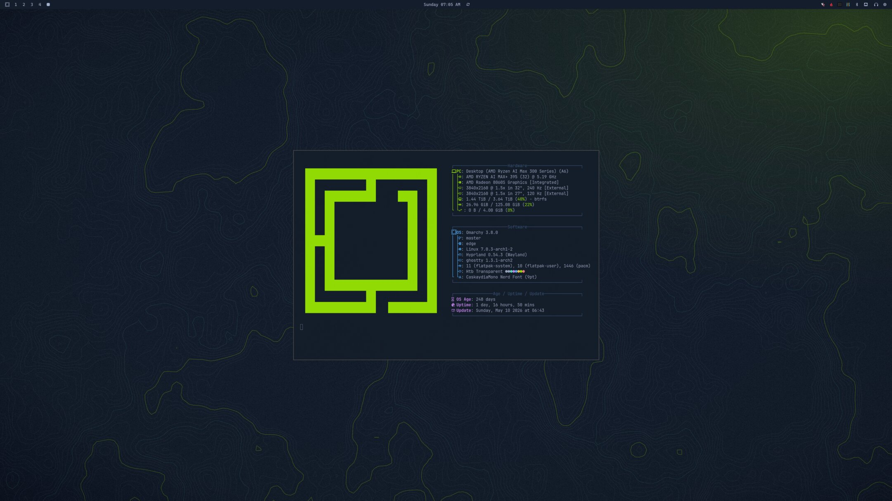

# hack-the-box

Omarchy theme based on the Hack The Box color scheme.



## Install

```bash
omarchy theme install https://github.com/TzZek/omarchy-hack-the-box-theme.git
```

Then apply it with:

```bash
omarchy theme set hack-the-box
```

## Included

- `colors.toml` for the core Omarchy palette
- `btop.theme` for btop
- `neovim.lua` for Neovim
- `vscode.json` for VS Code
- `zellij.kdl` for Zellij
- `icons.theme` for icon selection
- `keyboard.rgb` for keyboard lighting
- `backgrounds/` with the bundled `hack-the-box-*` wallpapers
